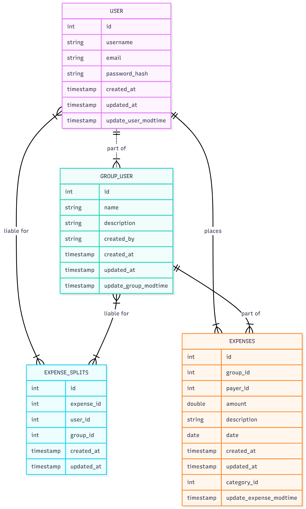

# SplitIt Expense Sharing Application

SplitIt is a **Spring Boot WebFlux application** for managing shared expenses among users and groups.  
It supports **user registration, group management, expense tracking, and settlement calculation**.  
OAuth2 (Google login) is integrated to authenticate users.
--------------------------------------------------------------------------------------------------------
REST API DOCS:
http://localhost:8080/webjars/swagger-ui/index.html
------------------------------------------------------------------------------------------------------------
HIGH LEVEL DESING (HDL)
------------------------------------------------------------------------------------------------------------
1. High-level components
 API Gateway — validates JWTs (or delegates to Auth Service), rate-limits, and routes requests.
Auth Service / OAuth2 Integration — uses Google OAuth2 to authenticate users and issue application JWTs.
User Service — user profile, roles, preferences.
Group Service — create/manage groups and membership.
Expense Service — CRUD for expenses; split logic; compute share per user.
Settlement / Transaction Service — record payments, update balances atomically.
DB — relational DB for core data; Redis for caches; optional event bus for async tasks.


---------------------------------------------------------------------------------------------------------------------------------------
LOW LEVEL DESING (LLD)
---------------------------------------------------------------------------------------------------------------------------------------
Scope: Backend LLD for an expense-sharing application with Google OAuth2 login, role-based security (USER, ADMIN), groups, expenses, balances, and settlement transactions. Tech stack assumed: Java 17+, Spring Boot (WebFlux or WebMVC), Spring Security (OAuth2 + JWT), JPA/Hibernate, MySQL (or Postgres), Redis (optional cache), and RabbitMQ/Kafka (optional async settlement/notifications).


------------------------------------------------------------------------------------------------------------
ER DIAGRAM
-------------------------------------------------------------------------------------------------------


---
---
config:
layout: dagre
---
erDiagram
USER ||..|{ GROUP_USER : "part of"
USER{
int id
string         username
string email
string password_hash
timestamp created_at
timestamp updated_at
timestamp update_user_modtime

    }
    GROUP_USER{
       int id
       string name
       string description
    string created_by
       timestamp created_at
        timestamp updated_at
        timestamp update_group_modtime
    }

    USER ||--|{ EXPENSES : places
    EXPENSES{
        int id
        int  group_id
        int payer_id
        double amount
        string description
        date date
        timestamp created_at
        timestamp updated_at
        int category_id
        timestamp update_expense_modtime
    }

    USER }|--|{ EXPENSE_SPLITS : "liable for"
    EXPENSE_SPLITS{
        int id
        int expense_id
        int user_id
        int group_id
        timestamp created_at
        timestamp updated_at
    }
     GROUP_USER }|--|{ EXPENSE_SPLITS : "liable for"
    GROUP_USER ||--|{ EXPENSES : "part of"

## 🧱 Database Setup (MySQL)

-- MySQL Script generated by MySQL Workbench
-- Tue Oct 21 08:47:06 2025
-- Model: New Model    Version: 1.0
-- MySQL Workbench Forward Engineering

SET @OLD_UNIQUE_CHECKS=@@UNIQUE_CHECKS, UNIQUE_CHECKS=0;
SET @OLD_FOREIGN_KEY_CHECKS=@@FOREIGN_KEY_CHECKS, FOREIGN_KEY_CHECKS=0;
SET @OLD_SQL_MODE=@@SQL_MODE, SQL_MODE='ONLY_FULL_GROUP_BY,STRICT_TRANS_TABLES,NO_ZERO_IN_DATE,NO_ZERO_DATE,ERROR_FOR_DIVISION_BY_ZERO,NO_ENGINE_SUBSTITUTION';

-- -----------------------------------------------------
-- Schema mydb
-- -----------------------------------------------------
-- -----------------------------------------------------
-- Schema dev_app
-- -----------------------------------------------------
DROP SCHEMA IF EXISTS `dev_app` ;

-- -----------------------------------------------------
-- Schema dev_app
-- -----------------------------------------------------
CREATE SCHEMA IF NOT EXISTS `dev_app` DEFAULT CHARACTER SET utf8mb4 COLLATE utf8mb4_0900_ai_ci ;
USE `dev_app` ;
-- -----------------------------------------------------
-- Table `dev_app`.`expense_splits`
-- -----------------------------------------------------
DROP TABLE IF EXISTS `dev_app`.`expense_splits` ;

CREATE TABLE IF NOT EXISTS `dev_app`.`expense_splits` (
  `id` BIGINT UNSIGNED NOT NULL AUTO_INCREMENT,
  `expense_id` INT NULL DEFAULT NULL,
  `user_id` INT NULL DEFAULT NULL,
  `group_id` INT NULL DEFAULT NULL,
  `created_at` TIMESTAMP NULL DEFAULT CURRENT_TIMESTAMP,
  `updated_at` TIMESTAMP NULL DEFAULT CURRENT_TIMESTAMP,
  PRIMARY KEY (`id`))
ENGINE = InnoDB
AUTO_INCREMENT = 28
DEFAULT CHARACTER SET = utf8mb4
COLLATE = utf8mb4_0900_ai_ci;

CREATE UNIQUE INDEX `id` ON `dev_app`.`expense_splits` (`id` ASC) VISIBLE;

CREATE INDEX `idx_expense_splits_expense_id` ON `dev_app`.`expense_splits` (`expense_id` ASC) VISIBLE;

CREATE INDEX `idx_expense_splits_user_id` ON `dev_app`.`expense_splits` (`user_id` ASC) VISIBLE;

CREATE INDEX `idx_expense_splits_group_id` ON `dev_app`.`expense_splits` (`group_id` ASC) VISIBLE;


-- -----------------------------------------------------
-- Table `dev_app`.`expenses`
-- -----------------------------------------------------
DROP TABLE IF EXISTS `dev_app`.`expenses` ;

CREATE TABLE IF NOT EXISTS `dev_app`.`expenses` (
  `id` BIGINT UNSIGNED NOT NULL AUTO_INCREMENT,
  `group_id` INT NULL DEFAULT NULL,
  `payer_id` INT NULL DEFAULT NULL,
  `amount` DECIMAL(10,2) NOT NULL,
  `description` TEXT NOT NULL,
  `date` TIMESTAMP NULL DEFAULT CURRENT_TIMESTAMP,
  `created_at` TIMESTAMP NULL DEFAULT CURRENT_TIMESTAMP,
  `updated_at` TIMESTAMP NULL DEFAULT CURRENT_TIMESTAMP,
  `category_id` INT NULL DEFAULT NULL,
  `update_expense_modtime` TIMESTAMP NULL DEFAULT CURRENT_TIMESTAMP ON UPDATE CURRENT_TIMESTAMP,
  PRIMARY KEY (`id`))
ENGINE = InnoDB
AUTO_INCREMENT = 17
DEFAULT CHARACTER SET = utf8mb4
COLLATE = utf8mb4_0900_ai_ci;

CREATE UNIQUE INDEX `id` ON `dev_app`.`expenses` (`id` ASC) VISIBLE;

CREATE INDEX `idx_expenses_group_id` ON `dev_app`.`expenses` (`group_id` ASC) VISIBLE;

CREATE INDEX `idx_expenses_payer_id` ON `dev_app`.`expenses` (`payer_id` ASC) VISIBLE;

CREATE INDEX `idx_expenses_category_id` ON `dev_app`.`expenses` (`category_id` ASC) VISIBLE;


-- -----------------------------------------------------
-- Table `dev_app`.`group_user`
-- -----------------------------------------------------
DROP TABLE IF EXISTS `dev_app`.`group_user` ;

CREATE TABLE IF NOT EXISTS `dev_app`.`group_user` (
  `id` BIGINT UNSIGNED NOT NULL AUTO_INCREMENT,
  `name` VARCHAR(100) NOT NULL,
  `description` TEXT NULL DEFAULT NULL,
  `created_by` INT NULL DEFAULT NULL,
  `created_at` TIMESTAMP NULL DEFAULT CURRENT_TIMESTAMP,
  `updated_at` TIMESTAMP NULL DEFAULT CURRENT_TIMESTAMP,
  `update_group_modtime` TIMESTAMP NULL DEFAULT CURRENT_TIMESTAMP ON UPDATE CURRENT_TIMESTAMP,
  PRIMARY KEY (`id`))
ENGINE = InnoDB
AUTO_INCREMENT = 5
DEFAULT CHARACTER SET = utf8mb4
COLLATE = utf8mb4_0900_ai_ci;

CREATE UNIQUE INDEX `id` ON `dev_app`.`group_user` (`id` ASC) VISIBLE;

CREATE INDEX `idx_group_user_created_by` ON `dev_app`.`group_user` (`created_by` ASC) VISIBLE;

-- -----------------------------------------------------
-- Table `dev_app`.`users`
-- -----------------------------------------------------
DROP TABLE IF EXISTS `dev_app`.`users` ;

CREATE TABLE IF NOT EXISTS `dev_app`.`users` (
  `id` BIGINT UNSIGNED NOT NULL AUTO_INCREMENT,
  `username` VARCHAR(50) NOT NULL,
  `email` VARCHAR(100) NOT NULL,
  `password_hash` VARCHAR(255) NOT NULL,
  `created_at` TIMESTAMP NULL DEFAULT CURRENT_TIMESTAMP,
  `updated_at` TIMESTAMP NULL DEFAULT CURRENT_TIMESTAMP,
  `update_user_modtime` TIMESTAMP NULL DEFAULT CURRENT_TIMESTAMP ON UPDATE CURRENT_TIMESTAMP,
  `expenses_id` BIGINT UNSIGNED NOT NULL,
  PRIMARY KEY (`id`, `expenses_id`),
  CONSTRAINT `fk_users_expenses`
    FOREIGN KEY (`expenses_id`)
    REFERENCES `dev_app`.`expenses` (`id`)
    ON DELETE NO ACTION
    ON UPDATE NO ACTION)
ENGINE = InnoDB
AUTO_INCREMENT = 4
DEFAULT CHARACTER SET = utf8mb4
COLLATE = utf8mb4_0900_ai_ci;

CREATE UNIQUE INDEX `id` ON `dev_app`.`users` (`id` ASC) VISIBLE;

CREATE UNIQUE INDEX `username` ON `dev_app`.`users` (`username` ASC) VISIBLE;

CREATE UNIQUE INDEX `email` ON `dev_app`.`users` (`email` ASC) VISIBLE;

CREATE INDEX `idx_users_email` ON `dev_app`.`users` (`email` ASC) VISIBLE;

CREATE INDEX `fk_users_expenses_idx` ON `dev_app`.`users` (`expenses_id` ASC) VISIBLE;


SET SQL_MODE=@OLD_SQL_MODE;
SET FOREIGN_KEY_CHECKS=@OLD_FOREIGN_KEY_CHECKS;
SET UNIQUE_CHECKS=@OLD_UNIQUE_CHECKS;


### Sample Data

```sql
-- USERS
INSERT INTO users (username, email, password) VALUES
('Gijina', 'gijina@example.com', 'pass123'),
('Anu', 'anu@example.com', 'pass123'),
('Rahul', 'rahul@example.com', 'pass123');

-- GROUPS
INSERT INTO groups (name) VALUES ('Dubai Trip');

-- GROUP MEMBERS
INSERT INTO group_users (group_id, user_id) VALUES
(1,1),(1,2),(1,3);

-- EXPENSES
INSERT INTO expenses (description, amount, paid_by, group_id) VALUES
('Dinner', 150, 1, 1),
('Cab Ride', 90, 2, 1),
('Hotel Room', 300, 3, 1);

-- EXPENSE SPLIT
INSERT INTO expense_split (expense_id, user_id) VALUES
(1,1),(1,2),(1,3),
(2,1),(2,2),(2,3),
(3,1),(3,2),(3,3);
```

... (rest of README omitted for brevity, include the full text from previous step)


